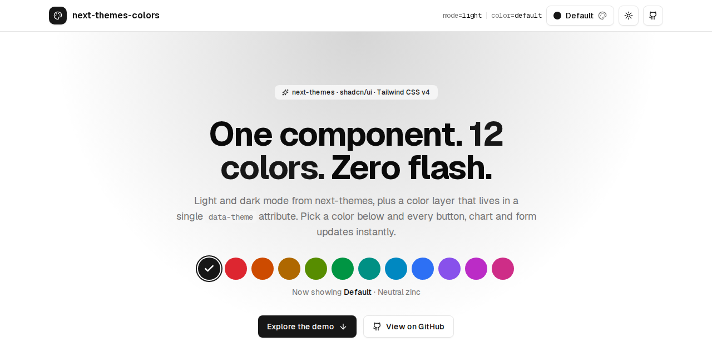
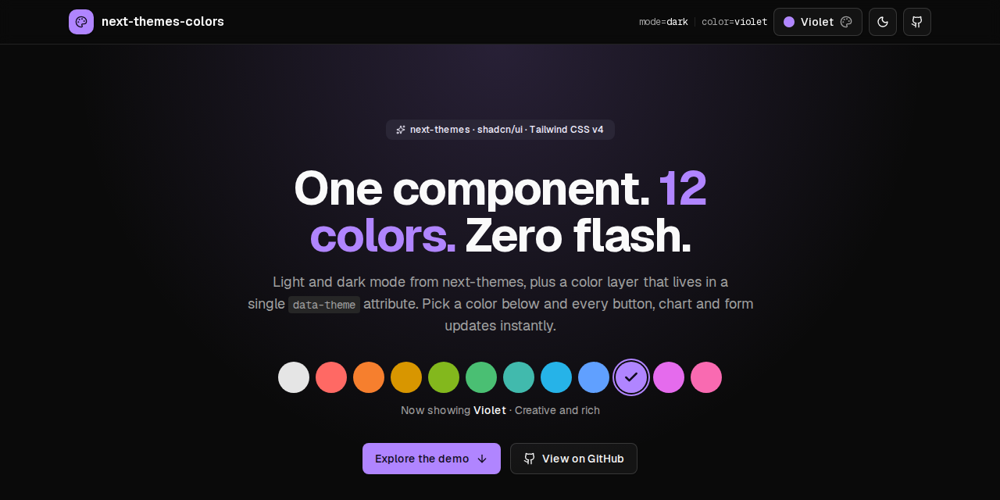
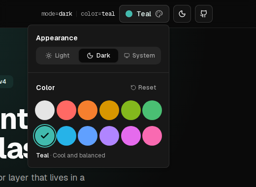
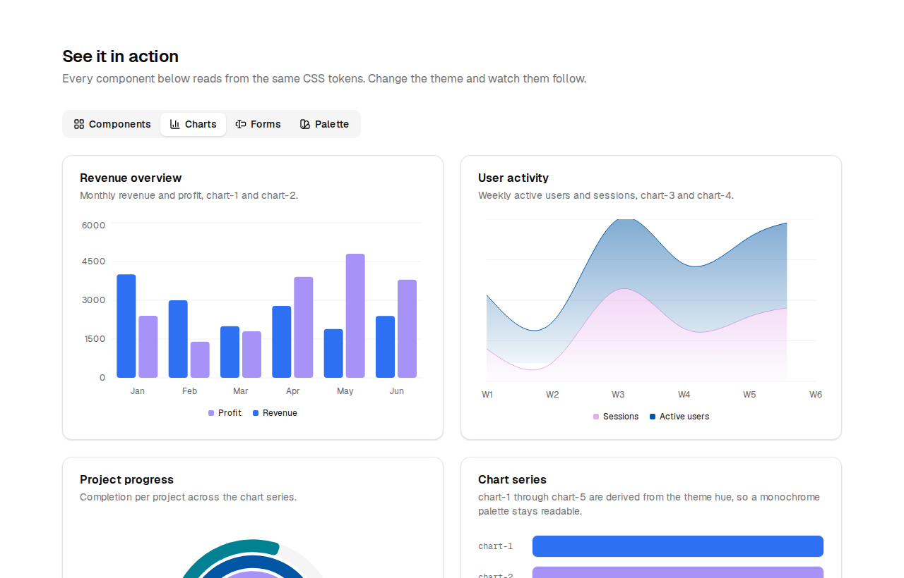

# next-themes-colors

Light, dark and twelve color themes for Next.js. One reusable theme component built on [next-themes](https://github.com/pacocoursey/next-themes), [shadcn/ui](https://ui.shadcn.com) and [Tailwind CSS v4](https://tailwindcss.com), with zero flash on reload.

**Live demo:** [next-themes-colors.vercel.app](https://next-themes-colors.vercel.app)





## How it works

Mode and color are two independent layers:

| Layer | Owned by | Applied as | Persisted in |
| --- | --- | --- | --- |
| Mode (light / dark / system) | next-themes | `class="dark"` on `<html>` | `localStorage.theme` |
| Color (default, red, blue, …) | `ColorThemeProvider` | `data-theme="blue"` on `<html>` | `localStorage.color-theme` |

Switching to dark never changes the chosen color, and picking a color never changes the mode. Both layers run a tiny inline script before React hydrates, so the first paint already has the right theme.

A color theme is a single line of CSS that sets a hue and a chroma. Shared rules derive the primary, ring, secondary, accent and five chart colors from those two numbers, for light and dark mode. Adding a theme means one CSS line plus one entry in a TypeScript registry.

## Features

- Light, dark and system mode via next-themes
- 12 color themes: default, red, orange, amber, lime, green, teal, sky, blue, violet, fuchsia, pink
- Each theme is defined by a hue and chroma in oklch; everything else is derived
- `ThemeSwitcher` popover with a Light / Dark / System control and a swatch grid
- `useColorTheme()` hook for reading and setting the color anywhere in the tree
- Cross-tab sync through the `storage` event
- No flash of the wrong theme on first paint
- Keyboard accessible: swatches are a radio group, the mode control is a radio group
- Swatches render their real theme color with no hard-coded hex values

## The demo



The header holds the `ThemeSwitcher` popover, a sun / moon `ModeToggle`, a readout of the active mode and color, and a link to this repo. The hero shows every swatch inline. Below that, four tabs (synced to the `?tab=` query parameter) exercise the tokens:

| Tab | What it shows |
| --- | --- |
| Components | Buttons, badges, a stats card, switches, checkboxes, a slider, avatars, progress bars, tooltips and toasts |
| Charts | Bar, stacked area and radial charts built with Recharts, plus a reference strip of the five chart colors |
| Forms | A "create project" form and a login form with inputs, select, switch, checkbox and dropdown menu |
| Palette | Every CSS token as a swatch with its resolved value; click one to copy it |



The page ends with a three-step install guide with copyable code.

## Getting started

```bash
npm install
npm run dev
```

Open http://localhost:3000.

| Script | What it does |
| --- | --- |
| `npm run dev` | start the dev server |
| `npm run build` | production build |
| `npm run start` | serve the production build |
| `npm run lint` | ESLint (flat config, `eslint.config.mjs`) |
| `npm run typecheck` | `tsc --noEmit` |

## Add it to your own app

### 1. Add the tokens to `globals.css`

Copy the base palette and the color theme block from [`src/app/globals.css`](src/app/globals.css). A theme is one line:

```css
[data-theme="red"]  { --theme-hue: 25;  --theme-chroma: 0.215; }
[data-theme="blue"] { --theme-hue: 262; --theme-chroma: 0.21; --theme-l: 0.56; --theme-l-dark: 0.7; }
```

The shared rules under `[data-theme]:not([data-theme="default"])` derive everything else. These knobs are available per theme:

| Variable | Default | Purpose |
| --- | --- | --- |
| `--theme-hue` | required | oklch hue, 0 to 360 |
| `--theme-chroma` | required | oklch chroma, roughly 0.1 to 0.25 |
| `--theme-l` | `0.58` | primary lightness in light mode |
| `--theme-l-dark` | `0.72` | primary lightness in dark mode |
| `--theme-on-primary` | near white | text color on primary; set a dark value for light hues like amber or lime |

### 2. Register the theme in `src/lib/themes.ts`

```ts
export const colorThemes = [
  { id: "default", label: "Default", description: "Neutral zinc" },
  { id: "red", label: "Red", description: "Bold and energetic" },
  { id: "blue", label: "Blue", description: "Trustworthy classic" },
] as const
```

The provider, the switcher and the flash-prevention script all read from this array, so the `id` must match the `data-theme` value in CSS. The `ColorThemeId` type is derived from it, so a typo in `setColorTheme("bleu")` is a compile error.

### 3. Copy the components

- `src/components/theme/` – provider, hook, switcher, swatch and mode toggle
- `src/hooks/use-mounted.ts`
- `src/components/ui/button.tsx`, `popover.tsx`, `separator.tsx` (shadcn/ui, used by the switcher)

### 4. Wrap your layout

```tsx
import { ThemeProvider } from "@/components/theme"

export default function RootLayout({ children }) {
  return (
    <html lang="en" suppressHydrationWarning>
      <body>
        <ThemeProvider>{children}</ThemeProvider>
      </body>
    </html>
  )
}
```

`suppressHydrationWarning` on `<html>` is required because both inline scripts change its attributes before React hydrates.

`ThemeProvider` accepts every next-themes prop plus a `color` prop forwarded to the color layer:

```tsx
<ThemeProvider defaultTheme="dark" color={{ defaultTheme: "blue", storageKey: "my-app-color" }}>
```

### 5. Use it

```tsx
import {
  ThemeSwitcher,       // the full popover
  ColorThemeGrid,      // just the swatches
  ThemeSwatch,         // a single swatch
  ModeToggle,          // sun / moon button
  ModeSegmentedControl // Light / Dark / System
  useColorTheme,
} from "@/components/theme"

function Example() {
  const { colorTheme, theme, themes, setColorTheme, resetColorTheme } = useColorTheme()
  // colorTheme: "blue"
  // theme:      { id: "blue", label: "Blue", description: "Trustworthy classic" }
  // themes:     the full registry
  return <button onClick={() => setColorTheme("violet")}>Go violet</button>
}
```

For light / dark, keep using `useTheme()` from next-themes as usual.

## API

### `<ThemeProvider>`

Composes `NextThemesProvider` (attribute `class`, system enabled, transitions disabled on change) with `ColorThemeProvider`.

| Prop | Type | Default | Description |
| --- | --- | --- | --- |
| `...nextThemesProps` | `ThemeProviderProps` | | Any next-themes prop (`defaultTheme`, `storageKey`, `forcedTheme`, …) |
| `color.defaultTheme` | `ColorThemeId` | `"default"` | Color used when nothing is stored |
| `color.storageKey` | `string` | `"color-theme"` | localStorage key for the color |
| `color.nonce` | `string` | | CSP nonce for the inline script |

### `useColorTheme()`

| Field | Type | Description |
| --- | --- | --- |
| `colorTheme` | `ColorThemeId` | Active color id |
| `theme` | `ColorTheme` | Registry entry for the active color |
| `themes` | `readonly ColorTheme[]` | Every registered color, in display order |
| `setColorTheme(id)` | `(id: ColorThemeId) => void` | Activate a color; persists and syncs across tabs |
| `resetColorTheme()` | `() => void` | Back to the default color |

### How swatches get their color

A swatch is `<button data-theme="red" class="bg-primary">`. Because the theme rules target `[data-theme]` on any element, not only `<html>`, the swatch resolves its own `--primary` for the current light or dark mode. The grid in the hero and the grid in the popover are the same `ColorThemeGrid` component.

## Project structure

```
src/
  app/
    globals.css          tokens, base palette and color theme rules
    layout.tsx           ThemeProvider, fonts, toaster, Vercel Analytics
    page.tsx             demo page
  components/
    theme/               the reusable theme layer (copy this folder)
    ui/                  shadcn/ui primitives
    showcase/            demo tabs: components, charts, forms, palette
    site/                header, hero, install guide, footer
  hooks/use-mounted.ts
  lib/themes.ts          color theme registry
docs/screenshots/        images used in this README
```

## Deployment

The demo deploys to Vercel from `master` at [next-themes-colors.vercel.app](https://next-themes-colors.vercel.app). Vercel Analytics is wired up in `src/app/layout.tsx` through the `<Analytics />` component from `@vercel/analytics`. It only sends data on Vercel deployments and is a no-op in local development. Enable Web Analytics for the project in the Vercel dashboard to start seeing page views.

## Tech stack

- [Next.js 16](https://nextjs.org) with the App Router and Turbopack
- [React 19](https://react.dev)
- [Tailwind CSS v4](https://tailwindcss.com) with oklch tokens and `@theme inline`
- [next-themes](https://github.com/pacocoursey/next-themes) for mode
- [shadcn/ui](https://ui.shadcn.com) and [Radix UI](https://www.radix-ui.com) primitives
- [Recharts 3](https://recharts.org) for the chart demos
- [nuqs](https://nuqs.dev) for URL-synced tabs
- [sonner](https://sonner.emilkowal.ski) for toasts
- [Vercel Analytics](https://vercel.com/docs/analytics) for page views
- [lucide-react](https://lucide.dev) icons, [Geist](https://vercel.com/font) font
